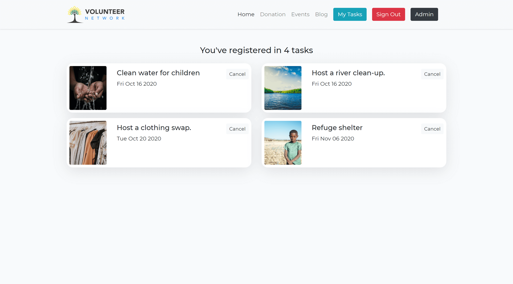
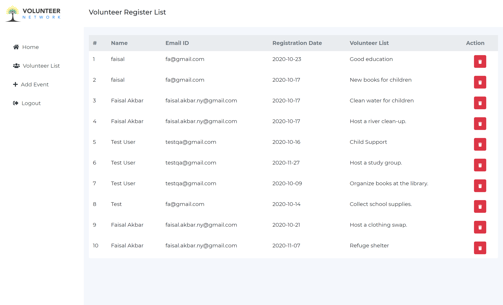
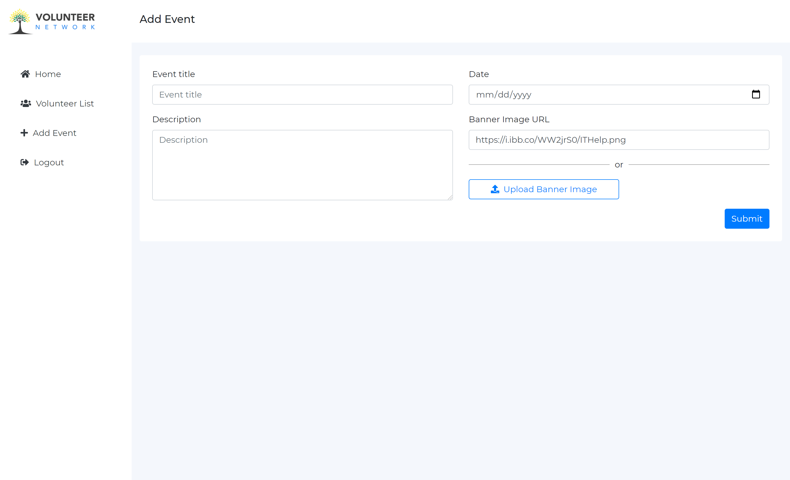

# Volunteer Network

A responsive social event management web application.

[Live Website](https://volunteer-network-6c5bc.firebaseapp.com/) | [Live API Server](https://volunteer-network-react.herokuapp.com)

## Feature

- Responsive MERN Stack project with firebase authentication and dashboard functionality for volunteer and admin.
- Volunteer can search, register in any event and view the events they already registered.
- Admin can view all the volunteer registered in any events and delete any volunteer if needed.
- Admin also can add new event from admin dashboard.
- Volunteer need to click on event image to register in specific event.
- Sign in is required to register in any event or to view volunteer dashboard.
- Logged in user will see a button named "My Tasks", where they can view the events they registered
- User can login through gmail or email and password if registered.

Note: Admin authentication functionality is not added yet, so anyone can add event or delete volunteer from the admin dashboard.

## Front-end Technology

- React JS
- Firebase Authentication (Google, Email/ Password)
- React Router, Private Router
- React Hook Form
- React Context API
- React Hook
- Firebase Hosting
- Bootstrap
- CSS3
- FontAwesome
- Faker Api

## Back-end Technology

- Node JS
- Express JS
- Mongodb
- Heroku
- Cors
- Body parser
- Dotenv
- nodemon

[Back-end Repository](https://github.com/faisalcep/volunteer_network_server)

---

## Key Feature Screenshots

> Logged In User Landing Page

<!--  -->

> Logged In User Dashboard

<!-- >  -->

> Admin Dashboard- Volunteer List

<!--  -->

> Admin Dashboard- Add Event

<!--  -->
